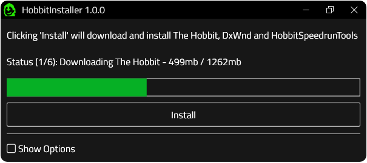

 

  

  <h2 align="center">HobbitInstaller</h2>

  

    <i>Install The Hobbit for speedrunning with the press of a button</i>
     
    <a href="../../issues">Report Issue</a>
    -
    <a href="../../issues">Request Feature</a>
  

# Table of Contents

- [About](#about)
- [Usage](#usage)
- [Troubleshooting](#troubleshooting)
- [Acknowledgements](#acknowledgements)

# About

This tool is made to break the entry barrier in The Hobbit speedruns. Now you no longer need to download multiple programs or mount disks, simply download this tool and click "Install"!

  

 

# Usage

Download the most recent release by going [here](../../releases) and clicking on HobbitInstaller.zip. Once it's downloaded go to your download folder with the windows file explorer then right click HobbitInstaller.zip. Press "Extract All" and a new window will pop up. Click "extract on this window" and you should see a new folder named HobbitInstaller. Open the folder and open HobbitInstaller.exe. Now just click "Install" and HobbitInstaller will do the rest. 

Optionally you can check "Show Options" in HobbitInstaller to choose where everything installs and if you want shortcuts. Do not use this unless you have a good reason to.

# Troubleshooting

If you run into any problems feel free to reach out to me on Discord (MKarma#0001). Make sure you screenshot whatever error message you might get. Be aware that the files this installer uses are self hosted, so in the case of a lot of traffic things could potentially slow down or break.

# Acknowledgements

- [ini-parser by Rickyah](https://github.com/rickyah/ini-parser) used to read and write to the config file
- [Newtonsont.Json](https://github.com/JamesNK/Newtonsoft.Json) for parsing the GitHub API reponses
- [René Sackers](https://stackoverflow.com/questions/20661652/progress-bar-with-httpclient) for the download progress updates

